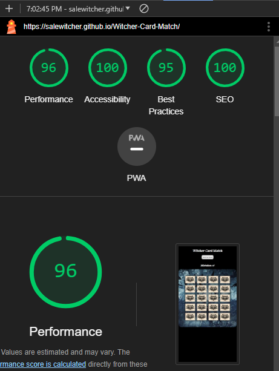
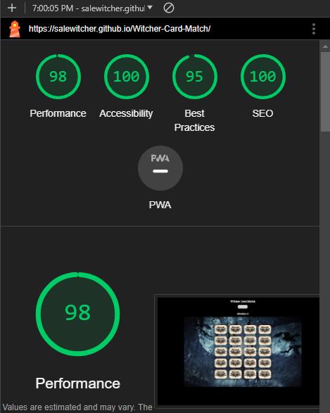
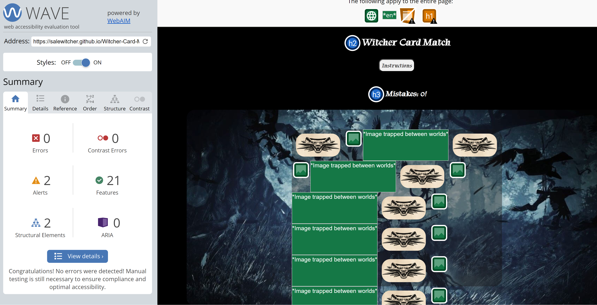

# Witcher Card Game

Witcher Card Game is a game that intends to attract people who are first of all gamers and after that lovers of the "Witcher" books, games TV Series, or whatnot. This game will be targeted towards all ages that are passionate and love the "Witcher" universe in general. Witcher Card Match will allow users to develop their memory abilities while having fun.

## Features

### Existing Features

- **Card matching**

  - Users can click the cards to reveal images and match pairs of cards.
 

- **Game Board**

  - Users can play on a dynamically created 4x5 grid.

- **Shuffling Cards**

  - Cards are shuffled at the beginning of the game for randomness.

- **Winning Condition**

  - If the users match all pairs they will win and trigger a victory message.

- **Errors Count**
  
  - Users can keep track of errors to challenge themselves.

- **Modals**

  - Users can choose to get instructions at the start if they click the corresponding button which shows the instruction modal, and see another modal when they win.

- **Try Again and Quit Buttons**

  - Users have a choice to try again or quit the game(The first button resets and the second stops the game).

- ## Testing

### Manual Testing

- All buttons work properly
- All modals work
- All cards turn when clicked on
- Cards stay open if matched
- Cards close if not matched
- Error counter works
- Try Again button resets the game
- Quit button stops the game
- When all cards are matched a win message appears

### Validator Testing

- HTML
  - No errors were returned when passing through the official [W3C validator](https://validator.w3.org/nu/#textarea)
  

- CSS
  - No errors were found when passing through the official [(Jigsaw) validator](https://jigsaw.w3.org/css-validator/validator)

- JS
  - No errors were found when passing through the official [JS Hint validator](https://jshint.com/)

### Lighthouse Testing

- All seems OK

### Accessibility Testing

- No errors found on [Wave Web Accessibility](https://wave.webaim.org/)

### Fixed Bugs

- Images for README.md were not visible (solution: instead of "\" put "/" in the path)
- When the game starts modals are visible (solution: display: none;)
- When the "Try Again" button is clicked the board starts with 40 instead of 20 images (solution: put the "resetGame()" into the "playAgain()" function and inside it add (document.getElementById("board").innerHTML = "";) so the board starts as an empty string and new cards can be added to it)

### Errors

- Unused semicolon (solution: Delete semicolon)

## Deployment

- The site was deployed to GitHub pages. The steps to deploy are as follows:
  - In the GitHub repository, navigate to the Settings tab
  - From the source section drop-down menu, select the Main Branch
  - Once the main branch has been selected, the page will be automatically refreshed with a detailed ribbon display to indicate the successful deployment.

The live link can be found here - <https://salewitcher.github.io/Witcher-Card-Match/>

## Credits

- Modals Idea taken from [W3Schools](https://www.w3schools.com/)
- Game Idea and parts of code taken from [KennyYipCoding](https://www.youtube.com/@KennyYipCoding)

### Content

- All content is written by the designer with the idea off course coming mostly from designer's favourite ever video game "Witcher 3 - The Wild Hunt""

### Media

- The favicon and images used are from [Google](https://www.google.com/search?q=witcher+wolf+school+logo+jpg+download&sca_esv=27178ea4ecd47877&rlz=1C1CHZN_enIE1075IE1075&sxsrf=ACQVn09fPZNenzhSjTRNBHaFX_cnUczegA%3A1706647641187&ei=WWC5ZYPUCpWBhbIPt4mPsAE&oq=witcher+wolf&gs_lp=Egxnd3Mtd2l6LXNlcnAiDHdpdGNoZXIgd29sZioCCAAyBBAjGCcyCxAuGIAEGIoFGJECMgUQABiABDILEAAYgAQYigUYkQIyCxAAGIAEGIoFGJECMgUQABiABDILEAAYgAQYigUYkQIyBRAAGIAEMgUQABiABDIFEAAYgARIwihQAFiQFHAAeAGQAQGYAcYCoAHRDKoBBzcuMy4wLjK4AQHIAQD4AQHCAgoQIxiABBiKBRgnwgIKEAAYgAQYigUYQ8ICChAuGIAEGIoFGEPCAgsQLhiABBixAxiDAcICCxAAGIAEGLEDGIMBwgIOEC4YgAQYsQMYxwEY0QPCAhcQLhiABBiKBRiRAhixAxiDARjHARjRA8ICERAuGIAEGLEDGMcBGK8BGI4FwgIOEC4YgAQYigUYsQMYgwHCAhAQLhiABBiKBRhDGLEDGNQCwgIQEAAYgAQYFBiHAhixAxiDAcICCBAAGIAEGLEDwgIQEC4YQxjUAhixAxiABBiKBcICBRAuGIAE4gMEGAAgQQ&sclient=gws-wiz-serp)

[Back To Top](#witcher-card-game)
