# Witcher Card Game

Witcher Card Game is a game that intends to attract people that are first of all gamers and after that lovers of the "Witcher" books, games TV Series or what not. This game will be targeted towards all ages that are passionate and love the "Witcher" universe in general. Witcher Card Match will give users the oportunity to develop their memory abilities while having fun.

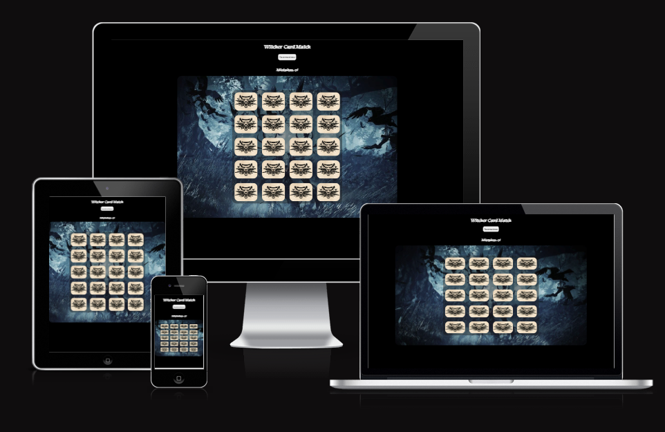

## Features

### Existing Features

- **Card matching**

  - Users are able to click the cards to reveal images and match pairs of cards.
 
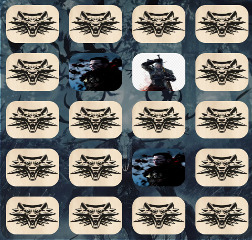
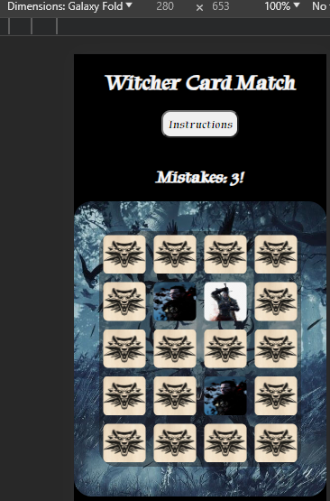

- **Game Board**

  - Users can play on a dynamically created 4x5 grid.

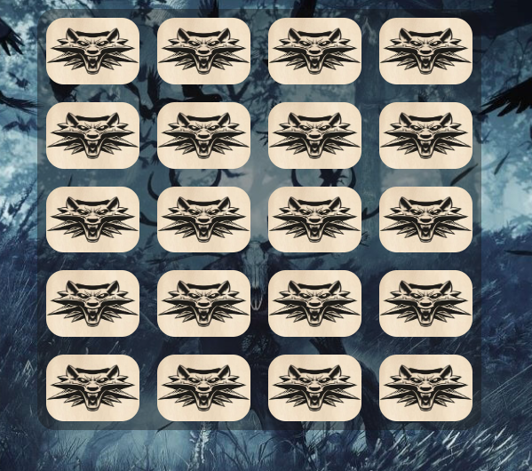

- **Shuffling Cards**

  - Cards are shuffled at the beginning of the game for randomness.

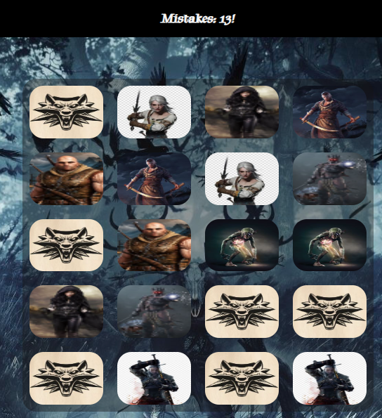

- **Winning Condition**

  - If the users match all pairs they will win and trigger a victory message.

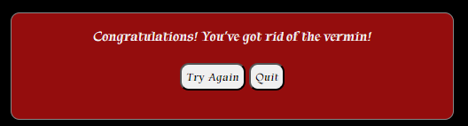

- **Errors Count**
  
  - Users can keep track of errors to challenge themselves.

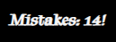

- **Modals**

  - Users can choose to get instructions at the start if they click the corresponding button which shows the instruction modal, and see another modal when they win.

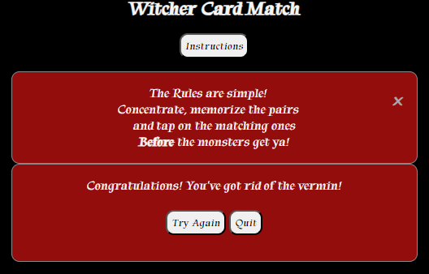

- **Try Again and Quit Buttons**

  - Users have a choice to try again or quit the game(First button resets and the second stops the game).

- ## Testing

### Manual Testing

- All buttons work properly
- All modals work
- All cards turn when clicked on
- Cards stay open if matched
- Cards close if not matched
- Error counter works
- Try Again button resets the game
- Quit button stops the game
- When all cards are mached a win message appears

### Validator Testing

- HTML
  - No errors were returned when passing through the official [W3C validator](https://validator.w3.org/nu/#textarea)
  
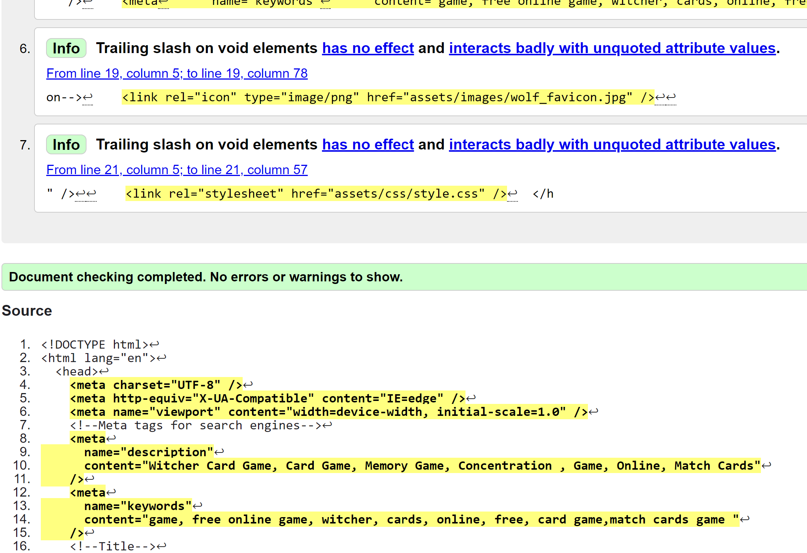

- CSS
  - No errors were found when passing through the official [(Jigsaw) validator](https://jigsaw.w3.org/css-validator/validator)

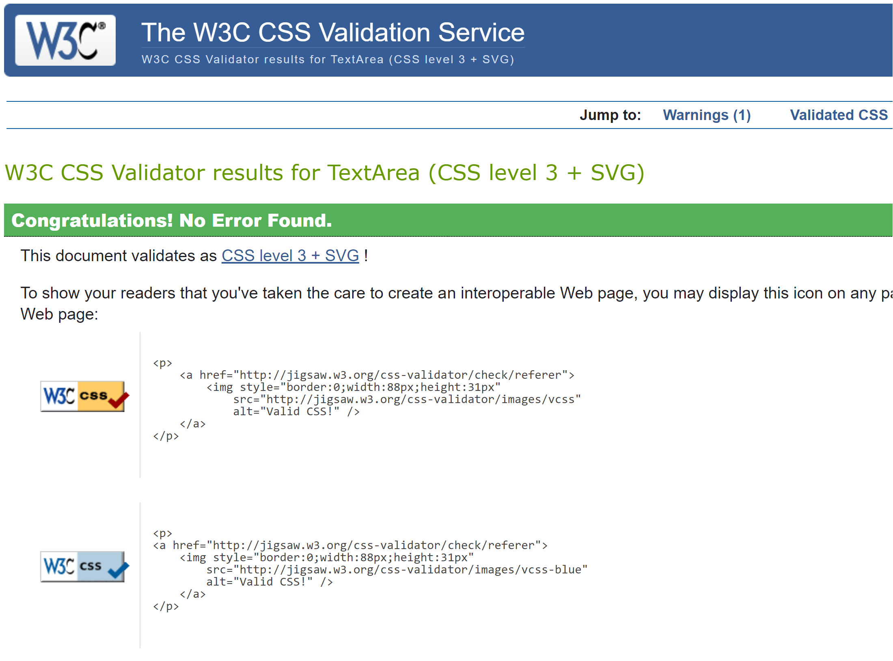

- JS
  - No errors were found when passing through the official [JS Hint validator](https://jshint.com/)

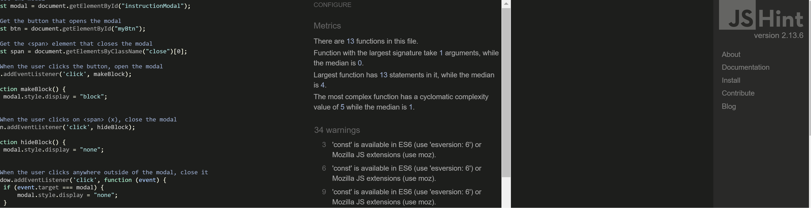

### Lighthouse Testing

- All seems OK except the Mobile index.html.
- Tried to resize images with better performance result but not in green.

### Accessibility Testing

- Two errors found on [Wave Web Accessibility](https://wave.webaim.org/)
- Considered to add an opacity background on wrapper div.
- Decided to leave like it is as a designer`s choice.

### Fixed Bugs

- Images for README.md were not visible (solution : instead of "\" put "/" in the path)
- Missing part of screen (solution: fixed by adding padding px instead %)
- scale:value; said command doesn`t exist (solution: transition: scale(value))

### Errors

- Unused semicolon (solution: Delete semicolon)

## Deployment

- The site was deployed to GitHub pages. The steps to deploy are as follows:
  - In the GitHub repository, navigate to the Settings tab
  - From the source section drop-down menu, select the Main Branch
  - Once the main branch has been selected, the page will be automatically refreshed with a detailed ribbon display to indicate the successful deployment.

The live link can be found here - <https://salewitcher.github.io/Chess-Lovers/>

## Credits

- Links hover idea from [CSS Tricks](https://css-tricks.com/css-link-hover-effects/)
- Parts of text taken from [Way too Wise](<https://way2wise.com/chess/chess-quotes/>)
- Youtube responsiness code borrowed from [CSS Trick: How to make an embedded iframe responsive?](https://www.youtube.com/watch?v=QG7JQkeaJy4)
- Some of form style found at [Front End Joe`s Page](https://frontendjoe.com/)
- Sign Up page background created at [Superdesigner](https://superdesigner.co/tools/css-backgrounds)
- Instructions on how to implement form validation on the Sign Up page was taken from [Love running](https://learn.codeinstitute.net/courses/course-v1:CodeInstitute+LRFX101+2023_Q2/courseware/e805068059af42af87681032aa64053f/fc8bba87c52a4d91b32d1c7c28b1d79b/?child=first)

### Content

- The text for the History page was taken from [Wikipedia] (<https://www.wikipedia.org/>)
- Images taken from [Pexels](https://www.pexels.com/search/chess/)
- Youtube video borrowed from[Gotham Chess](https://www.youtube.com/@GothamChess)

### Media

- The favicon used is from [Google](https://www.google.com/search?q=witcher+wolf+school+logo+jpg+download&sca_esv=27178ea4ecd47877&rlz=1C1CHZN_enIE1075IE1075&sxsrf=ACQVn09fPZNenzhSjTRNBHaFX_cnUczegA%3A1706647641187&ei=WWC5ZYPUCpWBhbIPt4mPsAE&oq=witcher+wolf&gs_lp=Egxnd3Mtd2l6LXNlcnAiDHdpdGNoZXIgd29sZioCCAAyBBAjGCcyCxAuGIAEGIoFGJECMgUQABiABDILEAAYgAQYigUYkQIyCxAAGIAEGIoFGJECMgUQABiABDILEAAYgAQYigUYkQIyBRAAGIAEMgUQABiABDIFEAAYgARIwihQAFiQFHAAeAGQAQGYAcYCoAHRDKoBBzcuMy4wLjK4AQHIAQD4AQHCAgoQIxiABBiKBRgnwgIKEAAYgAQYigUYQ8ICChAuGIAEGIoFGEPCAgsQLhiABBixAxiDAcICCxAAGIAEGLEDGIMBwgIOEC4YgAQYsQMYxwEY0QPCAhcQLhiABBiKBRiRAhixAxiDARjHARjRA8ICERAuGIAEGLEDGMcBGK8BGI4FwgIOEC4YgAQYigUYsQMYgwHCAhAQLhiABBiKBRhDGLEDGNQCwgIQEAAYgAQYFBiHAhixAxiDAcICCBAAGIAEGLEDwgIQEC4YQxjUAhixAxiABBiKBcICBRAuGIAE4gMEGAAgQQ&sclient=gws-wiz-serp)
- The icons in the footer & navbar menu were taken from [Font Awesome](https://fontawesome.com/)

[Back To Top](#witcher-card-game)
